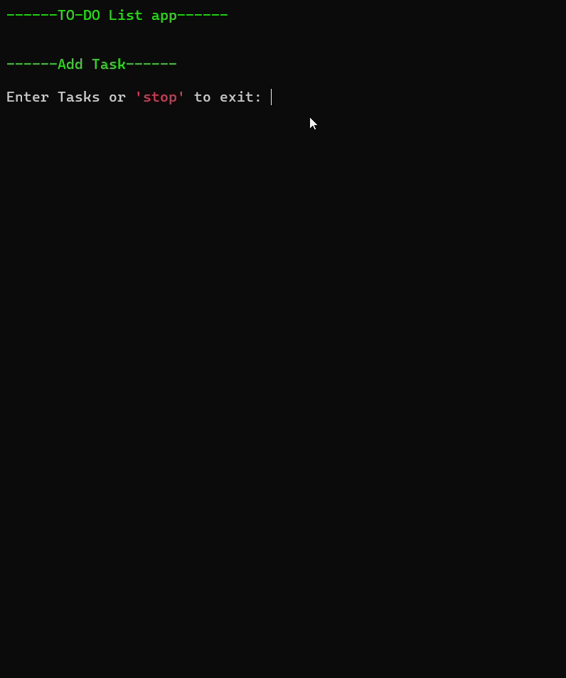

# 📝 To-Do List App (Python, Terminal)

  
  
  
  
  

A simple **command-line To-Do List app** built in Python.  
It allows you to **add, remove, show, sort, reverse, and clear tasks** right from your terminal.  

---

## 🚀 Features
- Add tasks
- Remove tasks
- Show all tasks
- Sort tasks (A–Z)
- Reverse task order
- Clear all tasks (with confirmation)
- Simple and colorful terminal UI 🎨

---

## 🖼️ Demo (Example)

---

## 📌 Future Improvements

💾 Save tasks using JSON file handling

📂 Load tasks from previous sessions

🎨 Add a GUI version (Tkinter / PyQt)

🌐 Maybe even a Web App with Flask or FastAPI

---

